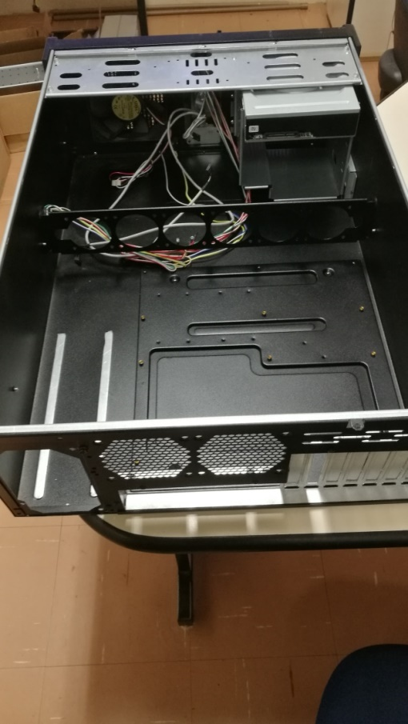

## Build instructions

We list below all instructions we followed to build the cooling system for 
a GPU NVIDIA Tesla V100 and for an FPGA Xilinx Alveo U280. The setup can be easily addapted for any card with similar cooling requirements. 

### Air duct desgin and construction 

1. Choose a PC case with a cooling fan mounting bracket roughly aligned with the motherboard slot
the high performance card will be installed into. We choose a locally-sourced Nilko NK211 4U
rack-mounting PC case, with a transversal plate allowing the installation of up to 6 60x60mm
cooling fans.   Choose a PC case with a cooling fan mounting bracket roughly aligned with the motherboard slot
the high performance card will be installed into. We choose a locally-sourced Nilko NK211 4U
rack-mounting PC case, with a transversal plate allowing the installation of up to 6 60x60mm
cooling fans. 

2. List

