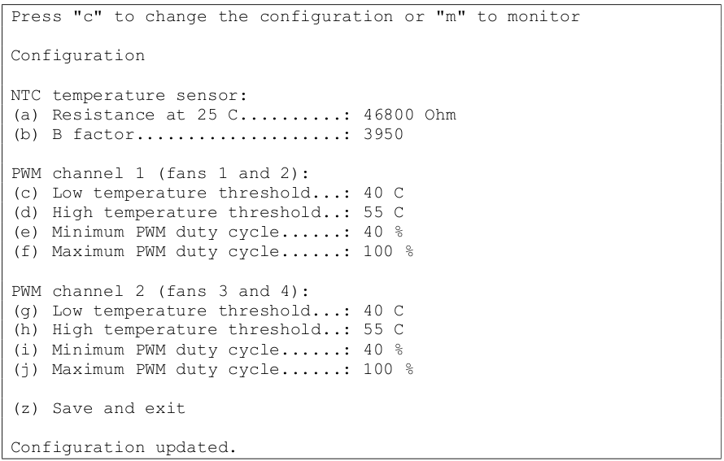

 

# Build instructions

We describe below all steps we have followed to build the cooling system for a GPU NVIDIA Tesla V100 and an FPGA Xilinx Alveo U280. The setup can be easily adapted for any card with similar cooling requirements. 

## Air duct desgin and construction 

1. To guarantee mechanical stability and avoid vibrations, the fan must be fixed in the computer case, and never at the card. To this end, it is important to employ a computer case with a transverse bracket for fans like that one depicted below, which corresponds to a locally sourced (Brazil) Nilko NK211 4U rack-mounting PC case.

 
 
Fig.1 An empty Nilko NK211 PC case used in this build.  Notice the transverse bracket for fans.

   
Fig.2 Nilko NK211 case with the GPU nVidia Tesla V100  and all PC components installed.   Notice
the 60x60x38 mm cooling fan mounting position (in front of the GPU card).

2. With the help of a cardboard sheet, for instance, draw the fan opening, mounting holes, and the reference marks for the 
card’s air intake, see below.

 
 
 
Fig.3 Drawing guide lines (left) and full contour (right) of the GPU air intake on the cardboard.
template

3. Mark the center of each of the duct openings and measure the vertical and horizontal distances between them. Such distances will be very important to align the openings when making the 3D model, as most 3D modeling software (we used Autodesk Fusion 360) have center-referenced primitives (rectangles and circles).

 
 
Fig.4 Cleaned-up outlines of the air duct intake (red) and outlet (blue)   and the respective center-to-center
measurements (“x” and “y”).

4. By using some 3D modeling software, draw a 4mm thick mounting flange for the air duct inlet (similar to the own mounting structure of the fan). Draw a hollow frame corresponding to the GPU (or FPGA) card’s air intake outline on the same diagram, at a plane offset from the origin given by the distance
between the fan mounting position and the card’s air intake (when installed in the PC case). Make this frame 15 mm high, 2.5 mm thick, and oversized in such a way that allows a gap of at least 5mm between the frame (which will become the duct’s air exit) and the board’s air intake. Refer to the measurements taken in the previous steps to align the two drawings. If possible, use the automatic composing features of the 3D modeling software to draw the air duct’s body between the two ends (we used the “loft” tool on Autodesk Fusion 360. As this tool deals only with a solid object, we used it twice: for the outer and inner duct shells and subtracted the resulting objects to obtain a hollow body).

 
 
 
Fig.5 Modeling the ends of the air duct (left) and using the 3D modeling software tools   to automatically
generate the complete smooth structure connecting them (right).

5. Make a test-fit part of the complete air duct using a 3D printer. You can use regular PLA and low
filling (about 10%) for this test. Mount the test-fit part on the PC case and measure the gap between
the duct and the CPU (of FPGA) card. Modify the 3D model in order to make this gap 4mm wide
and uniform on all sides.

   
Fig.6 Test-fit piece mounted on the PC case. Notice the wide and irregular gap   between the duct
and the nVidia GPU card’s air intake.

6. Make the final air duct using the 3D printer. Use a higher filling rate (we used 80%) to prevent the supporting flange from being crushed when the mounting screws get tightened up. Use High-Temperature PLA (also called “Premium PLA”) or similar material, as most regular PLAs soften and get deformed at temperatures as low as 50°C. The figure below depicts the ducts for our cards. For sake of illustration, we attach the respective 3D Manufacturing Format files (.3mf and .f3d), but of course, the design must be customized for the particular card  and computer case in question.

 
 
 
Fig.7 Final   air ducts for the nVidia Tesla V100 GPU (left) and Xilinx Alveo
U280 FPGA cards (right). 

## Assembly Instructions

1. Apply adhesive foam (6mm high, 10mm wide) on the internal wall of the air duct outlet
to seal the gap between the duct and the card.

 
 
Fig.8 Final air duct with rubber foam applied.

2. Install the cooler fan and the air duct on the PC case’s traverse bracket.  Use M4x12mm allen bolts, nuts, and lock washers to prevent losing due to the vibration.

 
 
Fig.9 Air duct and fan mounted on the PC case’s bracket.

3. Install the cooling assembly in the computer case. Connect the power supply cable on the high
performance card and insert its air intake into the air duct outlet. Place paper sheets between the
card’s body and the air duct outlet to prevent the rubber foam from being dragged inside when the
card is inserted. Insert the card carefully until the cooling assembly can be secured into its designed
position. Mount the cooling assembly to the PC case and remove the paper sheets.

4. Look into the air duct through the fan and check if the power cable for the high performance card
is in place (along the duct’s side). Use a long screwdriver to set the cable in place if needed.

5. Secure all cables and wires inside the PC case using cable ties or other cable management system.
Make sure no cable is in the way of the air flow neither can came in contact with the fan blades.

 
 
 

6. Install the fan controller and connect the high performance card’s fan to one of its temperature-
controlled PWM outputs. Install the controller’s temperature sensor on the back of the case, in the
board’s hot air outlet. Extend the sensor’s wires if needed.

 
 
 
  
7. Use some burn-in test program to stress the high performance card (for example, gpu-burn for the
nVidia Tesla: https://github.com/wilicc/gpu-burn). Configure the temperature controller to ensure
the board works within thermal specifications even with maximum power dissipation. We have set
the fan power (PWM duty cycle) at 40% and 100%, respectively for temperatures below 40°C and
above 55°C (for the intermediate temperatures, the fan power is linearly increased). This was done
on the Arduino-based fan controller using the settings shown below:
  

 
 

8. With this setup we saw a maximum GPU temperature of 67°C for a power draw of about 230W (as
reported by nVidia’s “nvidia-smi” utility) when running gpu-burn for 15 minutes. The ambient
temperature was 23°C.
  

 
 
  
